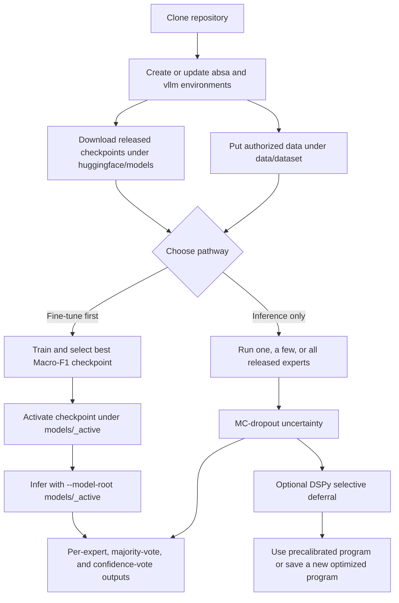

# AspectBench

AspectBench is the reusable release for document-level aspect-based sentiment
analysis in Slovenian and HBS (Bosnian/Croatian/Montenegrin/Serbian) news. It
contains fine-tuned model inference and training, Monte Carlo dropout
uncertainty, imbalance-aware evaluation, and DSPy selective deferral to local
LLMs.

- [Frontiers article](https://www.frontiersin.org/journals/artificial-intelligence/articles/10.3389/frai.2026.1844418/abstract)
- [HBS AspectBench 1.0 on CLARIN.SI](http://hdl.handle.net/11356/2356)
- [Hugging Face toolkit](https://huggingface.co/nishan-chatterjee/aspect-based-sentiment-analysis)
- [Hugging Face collection](https://huggingface.co/collections/nishan-chatterjee/aspect-based-sentiment-analysis-6a9016a6d9cab7b093f122d3)
- [Copy/paste interactive GPU runbook](docs/interactive-smoke-tests.md)

## What the system does

The practical configuration keeps a fine-tuned expert as the default and
routes only its least-confident cases to a local LLM. Fine-tuned PLM inference
first creates predictions, probabilities, and MC-dropout uncertainty. A frozen
DSPy program then decides whether to keep, override, or abstain on the gated
records; DSPy does not retrain or replace the PLM.


## Main paper findings

- The corpora contain 43,863 Slovenian train/validation and 7,740 test records,
  and 70,307 HBS train/validation and 12,407 test records. The class imbalance
  is substantial: Slovenian is approximately 1.2% negative, 82.6% neutral,
  and 16.2% positive; HBS is 7.5%, 49.5%, and 43.0%, respectively.
- The entity split is deliberately difficult: 69.2% of Slovenian and 59.1% of
  HBS test aspects are unseen in training. Reports therefore include overall,
  per-class, per-aspect, and seen/unseen Macro-F1 and quadratic weighted kappa.
- Aspect masking improved Macro-F1 in 13/18 and QWK in 14/18 reported model
  comparisons, but the best variant remains model- and language-dependent.
- Selective deferral was safer than complete LLM replacement. On Slovenian,
  routing 774/7,740 records (10%) raised masked Longformer Macro-F1 from 75.88
  to 77.34 and QWK from .729 to .745, with 45 corrections and 16 degradations.
  The HBS selective Longformer result reached 84.07 Macro-F1 and .830 QWK.
- Simple non-LLM aggregation remained competitive: Slovenian majority voting
  reached 76.35 Macro-F1; HBS confidence selection reached 84.18 Macro-F1 and
  .829 QWK.
- Learning curves show diminishing returns rather than one universal minimum:
  a broad performance band was reached around 40% of Slovenian and 30% of HBS
  training data, while the conservative one-standard-error rule selected 75%
  and 100%, respectively.

| Figure 2: Slovenian selective deferral | Figure 3: HBS selective deferral |
|---|---|
|  |  |


## Supported model registry

`--models` accepts one name, comma/space-separated names, or `all`. The three
names in examples are illustrative, not the complete list.

| Canonical name | Languages | Family |
|---|---|---|
| `xlmr` | HBS, Slovenian | XLM-R encoder |
| `han-xlmr` | HBS, Slovenian | hierarchical XLM-R |
| `longformer` | HBS, Slovenian | long-document XLM-R Longformer |
| `mdeberta-v3` | HBS, Slovenian | multilingual DeBERTa-v3 |
| `mt5` | HBS, Slovenian | text-to-text mT5 |
| `bertic` | HBS | BERTić |
| `sloberta` | Slovenian | SloBERTa |
| `bge-m3-mlp` | HBS, Slovenian | BGE-M3 dense embedding + MLP |

Every family has its own adapter under `src/aspectbench/models/`; numbered
files under `scripts/` only aggregate them. A requested missing checkpoint
fails clearly. With `--models all`, unavailable combinations are logged and
skipped so the remaining grid can finish. The public Hugging Face release
contains all 28 family/language/mode slots and the complete matrix has
passed load, single/batch inference, and MC-dropout smoke validation.

### Which model should I use?

Start with **masked XLM-R** (`--models xlmr --variant masked`). It has the best
three-run test Macro-F1 among the seven released single-model families in both
languages: 73.80 for Slovenian and 82.21 for HBS. For long articles, add
**masked Longformer**; for a structurally different hierarchical expert, add
**masked HAN-XLM-R**. The three-model command below is a practical first
ensemble and returns individual predictions plus majority and confidence
votes.

The following test-set scores are means over three fixed train/validation
splits; `±` is the standard deviation. Precision and recall are macro-averaged,
and all metrics except QWK are percentages. XLM-R `unmasked` is the paper's
**Truncated** strategy. XLM-R `masked` is **Truncated + Masked**: it was
completed after the accepted-manuscript table was assembled and is reported in
the preserved final-results analysis.

#### Slovenian released-model results

| Model | Strategy | Accuracy | Precision | Recall | Macro F1 | QWK | Negative F1 | Neutral F1 | Positive F1 |
|---|---|---:|---:|---:|---:|---:|---:|---:|---:|
| BGE-M3 + MLP | Unmasked | 90.17 ± 0.21 | 79.00 ± 2.69 | 63.16 ± 1.02 | 68.39 ± 1.03 | .640 ± .012 | 40.98 ± 2.25 | 94.18 ± 0.11 | 70.02 ± 1.14 |
| BGE-M3 + MLP | Masked | 90.39 ± 0.11 | 75.34 ± 1.72 | 62.86 ± 1.07 | 67.21 ± 1.29 | .653 ± .007 | 35.82 ± 3.88 | 94.29 ± 0.06 | 71.53 ± 0.64 |
| **XLM-R (truncated)** | Unmasked | 90.28 ± 0.33 | 73.12 ± 1.55 | 67.58 ± 0.29 | 70.03 ± 0.80 | .659 ± .013 | 43.90 ± 1.67 | 94.20 ± 0.19 | 71.99 ± 1.13 |
| **XLM-R (truncated)** | **Masked** | **91.11 ± 0.15** | **78.97 ± 2.18** | **70.59 ± 1.65** | **73.80 ± 1.69** | **.697 ± .006** | **51.56 ± 5.61** | **94.65 ± 0.09** | **75.18 ± 0.70** |
| HAN-XLM-R | Unmasked | 89.28 ± 0.25 | 71.05 ± 0.71 | 69.29 ± 0.69 | 70.11 ± 0.43 | .640 ± .007 | 46.36 ± 1.92 | 93.53 ± 0.15 | 70.42 ± 0.72 |
| HAN-XLM-R | Masked | 90.37 ± 0.15 | 74.64 ± 1.30 | 69.92 ± 1.39 | 71.57 ± 0.47 | .685 ± .001 | 46.05 ± 1.58 | 94.14 ± 0.11 | 74.51 ± 0.10 |
| XLM-R Longformer | Unmasked | 90.28 ± 0.18 | 73.72 ± 2.23 | 69.58 ± 2.13 | 71.47 ± 2.01 | .663 ± .008 | 48.12 ± 5.78 | 94.19 ± 0.10 | 72.09 ± 0.64 |
| XLM-R Longformer | Masked | 91.13 ± 0.43 | 78.68 ± 2.77 | 69.00 ± 0.55 | 72.50 ± 1.05 | .697 ± .013 | 47.50 ± 1.89 | 94.66 ± 0.26 | 75.35 ± 1.10 |
| mDeBERTa-v3 | Unmasked | 89.83 ± 0.97 | 74.59 ± 2.17 | 68.30 ± 1.19 | 70.71 ± 1.82 | .660 ± .020 | 46.18 ± 3.64 | 93.84 ± 0.65 | 72.11 ± 1.48 |
| mDeBERTa-v3 | Masked | 90.62 ± 0.26 | 77.41 ± 0.52 | 67.75 ± 0.71 | 71.30 ± 0.60 | .678 ± .011 | 45.86 ± 0.67 | 94.36 ± 0.15 | 73.66 ± 1.00 |
| mT5 | Unmasked | 90.25 ± 0.38 | 71.45 ± 1.87 | 65.21 ± 1.55 | 67.75 ± 0.42 | .661 ± .005 | 36.53 ± 1.59 | 94.16 ± 0.30 | 72.57 ± 0.70 |
| mT5 | Masked | 90.87 ± 0.24 | 77.27 ± 1.44 | 64.87 ± 1.91 | 69.37 ± 1.12 | .668 ± .013 | 40.85 ± 3.08 | 94.59 ± 0.14 | 72.69 ± 1.30 |
| SloBERTa | Unmasked | 91.28 ± 0.25 | 75.98 ± 1.33 | 71.17 ± 2.52 | 73.16 ± 1.03 | .700 ± .006 | 49.19 ± 3.57 | 94.77 ± 0.16 | 75.51 ± 0.75 |
| SloBERTa | Masked | 91.62 ± 0.02 | 77.19 ± 0.83 | 70.03 ± 0.12 | 73.03 ± 0.31 | .710 ± .005 | 47.59 ± 1.47 | 94.98 ± 0.02 | 76.52 ± 0.60 |

#### HBS released-model results

| Model | Strategy | Accuracy | Precision | Recall | Macro F1 | QWK | Negative F1 | Neutral F1 | Positive F1 |
|---|---|---:|---:|---:|---:|---:|---:|---:|---:|
| BGE-M3 + MLP | Unmasked | 83.95 ± 0.12 | 80.98 ± 0.17 | 77.16 ± 0.27 | 78.76 ± 0.25 | .759 ± .002 | 65.63 ± 0.60 | 84.16 ± 0.20 | 86.49 ± 0.01 |
| BGE-M3 + MLP | Masked | 84.05 ± 0.22 | 80.59 ± 0.12 | 77.72 ± 0.18 | 78.93 ± 0.11 | .761 ± .002 | 65.91 ± 0.33 | 84.18 ± 0.37 | 86.70 ± 0.22 |
| **XLM-R (truncated)** | Unmasked | 85.42 ± 0.22 | 84.63 ± 0.83 | 78.32 ± 0.60 | 80.84 ± 0.24 | .789 ± .003 | 69.36 ± 1.30 | 85.76 ± 0.20 | 87.41 ± 0.47 |
| **XLM-R (truncated)** | **Masked** | **86.37 ± 0.15** | **82.20 ± 0.18** | **82.33 ± 0.54** | **82.21 ± 0.35** | **.809 ± .004** | **71.35 ± 0.93** | **86.18 ± 0.08** | **89.10 ± 0.18** |
| HAN-XLM-R | Unmasked | 83.86 ± 0.43 | 80.81 ± 1.22 | 78.57 ± 0.56 | 79.50 ± 0.81 | .764 ± .005 | 68.34 ± 1.99 | 83.74 ± 0.39 | 86.41 ± 0.29 |
| HAN-XLM-R | Masked | 84.62 ± 0.30 | 80.39 ± 0.73 | 80.84 ± 0.47 | 80.53 ± 0.50 | .784 ± .004 | 69.84 ± 1.06 | 84.36 ± 0.35 | 87.39 ± 0.16 |
| XLM-R Longformer | Unmasked | 84.45 ± 0.34 | 83.28 ± 0.60 | 77.22 ± 0.50 | 79.65 ± 0.14 | .770 ± .005 | 67.63 ± 0.69 | 84.86 ± 0.22 | 86.47 ± 0.64 |
| XLM-R Longformer | Masked | 85.87 ± 0.09 | 81.39 ± 0.61 | 81.43 ± 0.19 | 81.37 ± 0.31 | .800 ± .001 | 69.60 ± 1.00 | 85.80 ± 0.22 | 88.69 ± 0.20 |
| mDeBERTa-v3 | Unmasked | 82.93 ± 1.78 | 82.75 ± 0.63 | 75.38 ± 2.28 | 78.08 ± 1.69 | .749 ± .028 | 66.12 ± 1.81 | 83.44 ± 1.01 | 84.67 ± 2.83 |
| mDeBERTa-v3 | Masked | 85.17 ± 0.40 | 83.00 ± 0.73 | 79.91 ± 0.02 | 81.15 ± 0.34 | .780 ± .004 | 70.96 ± 0.32 | 85.08 ± 0.64 | 87.42 ± 0.24 |
| mT5 | Unmasked | 83.98 ± 0.21 | 80.86 ± 0.99 | 76.90 ± 1.48 | 78.37 ± 0.53 | .761 ± .007 | 64.25 ± 1.22 | 83.92 ± 0.19 | 86.94 ± 0.46 |
| mT5 | Masked | 83.89 ± 0.64 | 78.48 ± 0.58 | 80.15 ± 0.79 | 79.07 ± 0.84 | .766 ± .010 | 66.43 ± 1.38 | 83.59 ± 1.03 | 87.19 ± 0.27 |
| BERTić | Unmasked | 86.31 ± 0.58 | 84.49 ± 0.17 | 79.74 ± 1.31 | 81.70 ± 0.86 | .802 ± .010 | 70.03 ± 1.57 | 86.38 ± 0.44 | 88.68 ± 0.66 |
| BERTić | Masked | 85.78 ± 0.38 | 82.69 ± 0.61 | 80.48 ± 0.36 | 81.44 ± 0.17 | .795 ± .004 | 70.30 ± 1.21 | 85.77 ± 0.37 | 88.24 ± 0.57 |

## Installation and environments

The `aspectbench` command exists only after this repository is installed. The
checked-in `absa.yml` and `vllm.yml` are exact conda exports with the
machine-specific `prefix` removed. Do this after cloning the repository:

```bash
source /opt/easybuild/software/Anaconda3/2024.02-1/etc/profile.d/conda.sh
bash scripts/0.0-bootstrap-environments.sh

conda activate absa
aspectbench models --models all
```

The bootstrap command creates missing `absa` and `vllm` environments from the
YAML files, installs this repository into both, and verifies the CLI. Existing
environments are left intact but the editable package is reinstalled. After a
pull that changes either YAML file, synchronize that environment—including
removing packages no longer declared in the export—with:

```bash
bash scripts/0.0-bootstrap-environments.sh --update
```

If the environments already contain the right dependencies, the immediate fix
for `aspectbench: command not found` is only the editable reinstall:

```bash
conda activate absa
python -m pip install -e . --no-deps
aspectbench models --models all
```

## Data, released models, and user checkpoints

Real records and large weights are intentionally ignored by Git but may exist
in both local release directories:

```text
data/hbs/{hbs_train_val_0,hbs_train_val_1,hbs_train_val_2,hbs_test,hbs_aspects}.json
data/sl/{slovene_train_val_0,slovene_train_val_1,slovene_train_val_2,slovene_test,slovene_aspects}.json
huggingface/models/MODEL/...             # released fine-tuned PLM checkpoints
models/MODEL/LANGUAGE/VARIANT/RUN-ID/... # newly trained checkpoints
models/_paper-splits/...                 # private 3-split paper/recovery archive
models/gemma3-27b-qat/...gguf            # local serving asset
models/qwen2.5-72b/...gguf               # local serving asset
outputs/inference/LANGUAGE/RUN-ID/...    # detailed and ensemble predictions
```

HBS records are distributed under the CLARIN.SI access terms. Slovenian
records remain private and must only be copied from authorized storage. The
Git repository contains neither corpus; `.gitignore` also excludes record-level
predictions, uncertainty shards, user checkpoints, and GGUF files.

Populate the canonical paths before running a GPU job:

```bash
# HBS: use either a downloaded CLARIN archive or an authorized record URL.
bash scripts/0.1-download-hbs.sh --archive /path/to/clarin-aspectbench.zip
# bash scripts/0.1-download-hbs.sh --url "$AUTHORIZED_CLARIN_DOWNLOAD_URL"

# Slovenian: local authorized JSON files only; never commit these records.
bash scripts/0.2-import-sl-data.sh --source /path/to/authorized/slovene-release

# Download the public released model repositories.
source /opt/easybuild/software/Anaconda3/2024.02-1/etc/profile.d/conda.sh
conda activate absa
hf auth login
python huggingface/scripts/download.py
```

The downloader writes all currently available released checkpoints under
`huggingface/models/`. Use repeated `--model MODEL` arguments to download only
selected repositories. `bertic` and `sloberta` are registry-level families
resolved from the language-specific contents of the `slavic-specific`
repository; users should select their canonical names at the CLI.

## Usage pathways



### Pathway A: inference with released fine-tuned models

Inference always returns the model prediction, posterior probabilities, and
MC-dropout uncertainty. With more than one expert it additionally returns:

- `majority_vote`: the most frequent label; a tie uses mean class probability,
  then the fixed neutral/negative/positive order if probabilities also tie.
- `confidence_vote`: the prediction from the expert with the largest posterior
  confidence. The selected model and variant are recorded explicitly.

For one tagged article, this direct command prints those decisions in the
terminal and also saves both output files:

```bash
source /opt/easybuild/software/Anaconda3/2024.02-1/etc/profile.d/conda.sh
conda activate absa
cd /Utilisateurs/nchatt01/GitHub/aspect-based-sentiment-analysis

ARTICLE='Tokom šestonedeljnog testiranja, redakcija je više puta kontaktirala <aspect>Primer Grupu</aspect> zbog nove usluge. Prvi odgovor <aspect>Primer Grupe</aspect> stigao je istog dana, a tehnički tim je zatim otklonio prijavljenu grešku bez dodatnih troškova. U završnom upitniku većina korisnika ocenila je podršku kao jasnu i pouzdanu.'

CUDA_VISIBLE_DEVICES=0 aspectbench infer \
  --models xlmr han-xlmr longformer --dataset hbs --variant masked \
  --run-id single-article --input-doc "$ARTICLE" --mc-passes 8 \
  --filename timestamp
```

The terminal JSON is shaped as follows (values below are illustrative):

```json
{
  "experts": [
    {"model": "xlmr", "variant": "masked", "prediction": 1,
     "prediction_name": "positive", "confidence": 0.91}
  ],
  "majority_vote": {"prediction": 1, "prediction_name": "positive",
    "vote_counts": {"-1": 0, "0": 1, "1": 2}, "tied": false},
  "confidence_vote": {"prediction": 1, "prediction_name": "positive",
    "selected_model": "xlmr", "selected_variant": "masked", "confidence": 0.91}
}
```

Labels are `-1 = negative`, `0 = neutral`, and `1 = positive`. Confidence is
the largest mean class probability, not calibrated accuracy. MC uncertainty
details—including entropy, top-two margin, agreement, and variation ratio—are
retained in the detailed output.

For a JSON/JSONL collection, the multi-GPU launcher assigns each model/variant
task to one GPU, preserves its resumable shards, and aggregates after every
task succeeds:

```bash
CUDA_VISIBLE_DEVICES=0,1 bash scripts/run-aspectbench.sh --inference \
  --gpus 0,1 --models 'xlmr,longformer,mdeberta-v3' --dataset hbs \
  --variant best --run-id hbs-inference --input data/hbs/hbs_test.json \
  --mc-passes 8 --filename timestamp
```

With a run started at 14:07 on 2 September 2026, the user-facing files are:

```text
outputs/inference/hbs/hbs-inference/2026-09-02-1407-predictions.json
outputs/inference/hbs/hbs-inference/2026-09-02-1407-predictions-ensemble.json
```

The first contains one row per expert and record; the second contains one row
per record with `experts`, `majority_vote`, and `confidence_vote`. It also
provides the scalar `majority_prediction` and `confidence_prediction` fields
so either decision can be passed directly to the scoring CLI. Use
`--filename predictions` for a stable name, `--filename seed --seed 17` for
`seed-17-predictions.json`, or `--filename experiment-a` for a custom stem.
All generated outputs are Git-ignored because their article fields may contain
restricted text.

`--models all` selects the full language-compatible registry, not only the
three illustrative models above. `--variant best` uses the paper-selected
variant for each model; `--variant both` treats each model/variant pair as an
expert. The launcher respects `PYTHON_BIN` when a specific interpreter is
needed.

### Pathway B: fine-tune, then infer

One full-training invocation consumes exactly one supplied train/validation
distribution. It validates every epoch, saves the best Macro-F1 checkpoint and
resumable optimizer state, activates that checkpoint, then automatically
creates resumable MC-dropout uncertainty shards for validation and every named
split:

```bash
source /opt/easybuild/software/Anaconda3/2024.02-1/etc/profile.d/conda.sh
conda activate absa

CUDA_VISIBLE_DEVICES=0,1,2,3 bash scripts/run-aspectbench.sh --train \
  --gpus 0,1,2,3 --models all --dataset hbs --variant best \
  --run-id hbs-train --train-input data/hbs/hbs_train_val_0.json \
  --val-input data/hbs/hbs_train_val_0.json \
  --uncertainty-input test=data/hbs/hbs_test.json --epochs 3 --mc-passes 10
```

Use `--train --smoke --input ...` for exactly one real optimizer update plus a
strict save/reload check. Runs are resumable by default; atomic shards,
manifests, progress JSON, and `_logs/` live under `models/_runs/`. See the
[interactive runbook](docs/interactive-smoke-tests.md) for `--input-doc`,
monitoring, and cleanup examples.

To train split 0 only, all three existing distributions, or three new
stratified distributions from one labeled input (seeds 1729/6174/8191), use
`scripts/3.8-train-split-grid-four-gpu.sh`. The full custom-loader contract,
per-split directory layout, best-split selection, and one-model examples are in
`docs/training-and-dspy-pathways.md`. The generic path initializes from
`--model-root`—the released fine-tuned checkpoint by default—so it is continued
fine-tuning/dataset transfer, not an implicit from-base paper reproduction.

After full training, `models/_active/` exposes the latest best checkpoints in
the same layout as `huggingface/models`. Pass `--model-root models/_active` to
inference or DSPy to reuse them; omit it to use the packaged fine-tuned models:

```bash
CUDA_VISIBLE_DEVICES=0,1 bash scripts/run-aspectbench.sh --inference \
  --gpus 0,1 --models 'xlmr,longformer' --dataset hbs --variant best \
  --run-id trained-model-inference --model-root models/_active \
  --input data/hbs/hbs_test.json --filename seed --seed 42
```

### Reproduce the recovered BGE-M3 + MLP release heads

The dedicated four-GPU launcher trains the HBS/Slovenian × masked/unmasked
grid. Each GPU encodes one dataset/variant once, caches restart-safe normalized
BGE-M3 embeddings, then trains the 512→256→3 MLP on splits 0, 1, and 2. It
selects the release head by validation Macro-F1 and only then evaluates and
compares all three split heads with the paper values.

The canonical four-head recovery (`bge-m3-paper-recovery`) completed without a
material paper-metric difference and passed all four single/batch inference
checks. The tensor-only heads are stored in the public
`nishan-chatterjee/aspectbench-bge-m3-mlp` repository; the command below is the
fully reproducible training path, not a prerequisite for ordinary inference.

```bash
source /opt/easybuild/software/Anaconda3/2024.02-1/etc/profile.d/conda.sh
conda activate absa
cd /Utilisateurs/nchatt01/GitHub/aspect-based-sentiment-analysis

PYTHON_BIN=/Utilisateurs/nchatt01/.conda/envs/absa/bin/python \
GPU_IDS=0,1,2,3 \
RUN_ID=bge-m3-paper-recovery \
EMBEDDING_BATCH_SIZE=8 \
bash scripts/3.3-train-bge-m3-mlp-four-gpu.sh
```

Re-run the identical command to resume completed embedding shards and epochs.
If BGE embedding runs out of memory on a long batch, use
`EMBEDDING_BATCH_SIZE=4` or `2`; this does not change the MLP batch size or
release layout. Float32 embedding is the reproducibility default, and the
launcher pins the BGE-M3 revision recorded in its cache manifest. The four
selected tensor-only heads are promoted to:

```text
huggingface/models/bge-m3-mlp/hbs/masked.pt
huggingface/models/bge-m3-mlp/hbs/unmasked.pt
huggingface/models/bge-m3-mlp/slovenian/masked.pt
huggingface/models/bge-m3-mlp/slovenian/unmasked.pt
```

Private cache, optimizer state, logs, predictions, per-class/seen-unseen
reports, and `comparison-to-paper.json` remain under
`huggingface/models/bge-m3-mlp/training/` and are ignored by Git and the model
upload. Monitor with:

```bash
tail -F huggingface/models/bge-m3-mlp/training/runs/bge-m3-paper-recovery/_logs/*.log
```

Do not upload immediately after training. First run the BGE-only inference
validator and inspect the paper-delta report; the Hugging Face upload command
remains a dry run unless `--execute` is explicitly supplied.

### Recover the remaining XLM-R and HAN-XLM-R heads

The four formerly unavailable unmasked XLM-R and HAN-XLM-R heads for HBS and
Slovenian were recovered with this launcher. It assigns one slot to each of
four 48 GB A40/A6000 GPUs. Every process trains fixed splits 0, 1, and 2,
selects by validation Macro-F1, evaluates all split heads on test, and promotes
one tensor-only checkpoint to the matching Hugging Face path.

```bash
source /opt/easybuild/software/Anaconda3/2024.02-1/etc/profile.d/conda.sh
conda activate absa
cd /Utilisateurs/nchatt01/GitHub/aspect-based-sentiment-analysis

PYTHON_BIN=/Utilisateurs/nchatt01/.conda/envs/absa/bin/python \
GPU_IDS=0,1,2,3 \
RUN_ID=xlmr-han-paper-recovery \
HAN_BATCH_SIZE=2 \
HAN_EFFECTIVE_BATCH_SIZE=32 \
bash scripts/3.5-train-missing-transformers-four-gpu.sh
```

Re-run that exact command and `RUN_ID` after a preemption. Completed splits are
skipped, and an interrupted split resumes from its most recent optimizer-step
checkpoint (every 100 steps by default) rather than restarting. The XLM-R jobs
use the paper configuration (10 epochs, batch 32, 2e-5); the HAN jobs use 10
epochs, 1e-5, 128 sentences × 96 tokens, and effective batch 32. If HAN exceeds
48 GB, use a new `RUN_ID` with `HAN_BATCH_SIZE=1`; accumulation is adjusted
automatically, so the effective batch remains 32. Micro-batch size is part of
the run manifest, and changing it under an existing run ID is rejected.

Monitor and inspect the eventual outputs with:

```bash
tail -F huggingface/models/_recovery/runs/xlmr-han-paper-recovery/_logs/*.log

find huggingface/models/{xlmr,han-xlmr}/training/runs/xlmr-han-paper-recovery \
  -name training-report.json -o -name selection.json

cat huggingface/models/_recovery/runs/xlmr-han-paper-recovery/comparison-to-paper.json
```

The promoted paths are
`huggingface/models/{xlmr,han-xlmr}/{hbs,slovenian}/unmasked.pt`. Training
states, row-level predictions, and logs are ignored by Git and by Hugging Face
uploads. Validate both families before upload:

```bash
python huggingface/scripts/validate_all.py \
  --model xlmr --model han-xlmr --model-root huggingface/models \
  --examples-root huggingface/examples --device cuda --batch-size 1 \
  --mc-passes 2 --require-complete-matrix \
  --output huggingface/models/_recovery/runs/xlmr-han-paper-recovery/inference-validation.json

# Dry run: exactly the two model repositories, never the shared toolkit.
python huggingface/scripts/upload.py --root huggingface --models-only \
  --model xlmr --model han-xlmr
```

## Precalibrated and newly optimized DSPy programs

Audited paper-time programs are tracked at:

```text
selective-deferral-programs/precalibrated/MODEL/DATASET/PROMPT-VARIANT/
```

Use them over the released fine-tuned models with
`--program-source precalibrated`. A user’s programs optimized on the same or a
new authorized dataset are kept separately at:

```text
selective-deferral-programs/optimized/MODEL/DATASET/PROMPT-VARIANT/RUN-ID/
```

That second tree is ignored by Git and selected with
`--program-source optimized --program-run-id RUN-ID`. Program metadata is
checked against the primary model, dataset, and prompt variant before querying.
The three historical Slovenian programs that embedded article examples are not
published; their public replacements are sanitized, example-free programs
with new checksums and no claim of behavioral identity.

Example using a packaged program and four local Gemma endpoints:

```bash
PYTHON_BIN=/Utilisateurs/nchatt01/.conda/envs/vllm/bin/python \
DATASET=hbs INPUT=data/hbs/hbs_test.json TASK_FILTER=all \
VARIANT_MODE=best PROMPT_VARIANTS='masked unmasked' GATE_RATE=0.10 \
STUDENT_API_BASES='http://127.0.0.1:18000/v1,http://127.0.0.1:18001/v1,http://127.0.0.1:18002/v1,http://127.0.0.1:18003/v1' \
NUM_WORKERS_PER_ENDPOINTS='12,12,12,12' MAX_PARALLEL=1 \
bash scripts/2.4-query-dspy-programs.sh
```

To validate every published program with one real forced-deferral query, while
also proving that unsupported slots are reported rather than silently
substituted, let the four-GPU smoke launcher start a conservative Gemma server
on GPU 3 and schedule the fine-tuned experts over GPUs 0–2:

```bash
PYTHON_BIN=/Utilisateurs/nchatt01/.conda/envs/absa/bin/python \
GPU_IDS=0,1,2,3 RUN_ID=dspy-public-program-smoke \
GEMMA_MODEL=models/gemma3-27b-qat/gemma-3-27b-it-q4_0.gguf \
LLAMA_SERVER=./llama.cpp/build/bin/llama-server \
CONTEXT_SIZE=49152 PARALLEL=4 \
bash scripts/2.5-dspy-release-smoke-four-gpu.sh
```

The current matrix expects 18 successful public programs and ten explicit
skips: the two prompt variants for mT5 in both languages, BGE-M3-MLP in both
languages, and Slovenian mDeBERTa-v3. No unrelated program is used as a
fallback. The preserved summary is
`models/_runs/dspy-release-smoke/dspy-public-program-smoke/summary.json`.

To smoke-test optimization, serialization, reload, and one query of a newly
created private program, run:

```bash
PYTHON_BIN=/Utilisateurs/nchatt01/.conda/envs/absa/bin/python \
GPU_IDS=0,1,2,3 RUN_ID=dspy-optimize-smoke \
bash scripts/4.3-dspy-optimization-smoke-four-gpu.sh
```

The optimized program is written beneath the ignored `optimized/` tree shown
above; it is never promoted to `precalibrated/` automatically.

## Local LLM serving rule of thumb

On a 48 GB A40/A6000, start one quantized Gemma server per GPU with 16 slots
and a 196,608-token total context: 16 × 12,288 tokens per slot. If it does not
fit, reduce context and parallelism by the same factor, for example
98,304/8 or 49,152/4. On a 96 GB H100, 589,824/48 uses the same per-slot
budget. `-c` is the server-wide context pool, not the per-request limit.

```bash
# Four 48 GB GPUs, ports 18000-18003.
GPU_IDS=0,1,2,3 PORTS=18000,18001,18002,18003 \
CONTEXT_SIZE=196608 PARALLEL=16 \
bash scripts/2.3-launch-gemma-llama-cpp.sh

# One 96 GB H100.
CUDA_VISIBLE_DEVICES=0 bash scripts/2.0-serve-llm.sh --backend llama-cpp \
  --llama-server ./llama.cpp/build/bin/llama-server \
  --model models/gemma3-27b-qat/gemma-3-27b-it-q4_0.gguf \
  --model-alias gemma27b --host 0.0.0.0 --port 8000 \
  --context-size 589824 --parallel 48 --run-id gemma-h100
```

The runbook also includes two-GPU vLLM Gemma/Qwen serving and DSPy MIPROv2
student/teacher optimization. Model fit still depends on quantization, KV-cache
type, build, and concurrent prompt lengths, so begin conservatively and inspect
the saved server log.

## Evaluation and extending the release

```bash
aspectbench score --predictions predictions.json \
  --train-data data/hbs/hbs_train_val_0.json --output report.json

# Score an ensemble export instead of per-expert rows.
aspectbench score \
  --predictions outputs/inference/hbs/hbs-inference/predictions-ensemble.json \
  --prediction-key majority_prediction \
  --train-data data/hbs/hbs_train_val_0.json --output majority-report.json
```

The report includes overall Macro-F1/QWK, per-class metrics, per-aspect
Macro-F1/QWK, imbalance diagnostics, and seen/unseen results. A runnable
example is in `notebooks/evaluation-and-aspect-reporting.ipynb`. See
`docs/extending-models-and-data.md` for the kebab-case model registration and
new-dataset contracts.

For the exact one-versus-three-distribution training contract, custom dataset
loader interface, four-A40 update smoke, public DSPy program matrix, and
optimization/reload smoke, see `docs/training-and-dspy-pathways.md`. Current
completion and GPU checks that still need to be run are recorded in
`docs/refactor-release-tracker.md`.

### Model privacy and memorization screen

`notebooks/model-privacy-and-memorization-audit.ipynb` provides an
aggregate-only release audit for accidental checkpoint payloads, black-box
membership inference, and target-identity counterfactual sensitivity. It does
not claim differential privacy or prove that extraction is impossible. The
default configuration is HBS and does not run model queries until explicitly
enabled. Restricted Slovenian evaluation requires
`ALLOW_RESTRICTED_SLOVENE=1`, and all reports are written under the ignored
`outputs/privacy-audit/` tree without article text, aspect names, or per-record
probabilities.

For a stronger release audit, use
`notebooks/model-privacy-extraction-and-distribution-audit.ipynb` together with
the resumable `scripts/6.1-run-privacy-audit-four-gpu.sh` launcher. The expanded
audit separates model signal from exact/near-duplicate records and text
distribution shift, scans every Git-tracked text artifact for exact records,
aspect identifiers, and 24-token corpus shingles, measures aspect-name support
and aspect-only label priors, runs validation- and test-based membership
attacks, and compares member versus nonmember behavior under pseudonym and
aspect-permutation counterfactuals. The release-surface scan emits file paths
and aggregate counts only; it never writes the matching corpus material.

On an authorized four-A40 allocation:

```bash
source /opt/easybuild/software/Anaconda3/2024.02-1/etc/profile.d/conda.sh
conda activate absa
cd /Utilisateurs/nchatt01/GitHub/aspect-based-sentiment-analysis

PYTHON_BIN=/Utilisateurs/nchatt01/.conda/envs/absa/bin/python \
GPU_IDS=0,1,2,3 \
RUN_ID=privacy-release-audit \
MODELS=all \
MC_PASSES=8 \
ALLOW_RESTRICTED_SLOVENE=1 \
bash scripts/6.1-run-privacy-audit-four-gpu.sh
```

The four workers are `hbs/masked`, `hbs/unmasked`, `sl/masked`, and
`sl/unmasked`. Each worker processes its available models sequentially on one
GPU. Reports, `_SUCCESS.json` resume markers, progress files, and `_logs` live
under `outputs/privacy-audit/<RUN_ID>/`; this entire tree is ignored because it
contains internal analysis, although the implemented reports are aggregate
only. Re-run the identical command and `RUN_ID` after preemption. Monitor with:

```bash
watch -n 10 'find outputs/privacy-audit/privacy-release-audit -name progress.json -o -name "_SUCCESS.json" | sort'
tail -f outputs/privacy-audit/privacy-release-audit/_logs/*.log
```

The command above is the breadth-first screen: it audits every available
model/language/variant slot with 384 label-matched members and nonmembers per
comparison. If a slot triggers—or if a low-FPR result is required for the
release decision—rerun one model with larger cohorts. The sampler keeps the
sentiment counts identical between members and nonmembers without discarding
most negative/positive rows merely because neutral is rare:

```bash
PYTHON_BIN=/Utilisateurs/nchatt01/.conda/envs/absa/bin/python \
GPU_IDS=0,1,2,3 \
RUN_ID=privacy-xlmr-low-fpr \
MODELS=xlmr \
MAX_PER_COHORT=3000 \
MC_PASSES=8 \
ALLOW_RESTRICTED_SLOVENE=1 \
bash scripts/6.1-run-privacy-audit-four-gpu.sh
```

This second command still runs four independent jobs (HBS/Slovenian ×
masked/unmasked), but only for XLM-R. Reuse it with a comma-separated subset
such as `MODELS=xlmr,han-xlmr`; retain the same `RUN_ID` after preemption.

After the GPU workers finish, preserve notebook outputs as both an executed
notebook and HTML report:

```bash
RUN_ID=privacy-release-audit \
bash scripts/6.3-render-privacy-audit-notebook.sh
```

To execute and preserve the earlier, narrower notebook instead:

```bash
RUN_ID=privacy-release-audit-basic \
SOURCE_NOTEBOOK=notebooks/model-privacy-and-memorization-audit.ipynb \
RUN_MODEL_ATTACKS=1 \
RUN_COUNTERFACTUALS=1 \
CUDA_VISIBLE_DEVICES=0 \
bash scripts/6.3-render-privacy-audit-notebook.sh
```

No extra package is normally required beyond `absa.yml`; the audit uses
PyTorch, Transformers, NumPy, pandas, scikit-learn, and Jupyter. A passed audit
supports the bounded statement that no material leakage was detected by the
documented attacks. It is not differential privacy and cannot prove that every
possible extraction or inversion attack will fail.

The membership report records two-sided permutation significance and
true-positive rates at empirical 5%, 1%, and 0.1% false-positive operating
points. A cohort of 384 cannot resolve 0.1% FPR, and the report says so rather
than returning a misleading number. Treat the default run as a screen; for a
low-FPR follow-up on selected models, use at least 2,000–5,000 records per
cohort and preferably independently trained shadow/reference models. The
text-only distribution classifier fits TF–IDF inside each held-out fold so its
AUC does not benefit from test-fold vocabulary or IDF statistics.

### Four-GPU Hugging Face release smoke test

The release smoke test downloads the public Hugging Face repositories into an
ignored validation run, records the resolved remote revisions, then tests every
model family against both `huggingface/examples/hbs-tagged-examples.json` and
`huggingface/examples/sl-tagged-synthetic-examples.json`. Every available
language/mode slot must pass model loading, one-record inference, batched
inference, probability validation, and MC-dropout uncertainty validation.

```bash
source /opt/easybuild/software/Anaconda3/2024.02-1/etc/profile.d/conda.sh
conda activate absa
cd /Utilisateurs/nchatt01/GitHub/aspect-based-sentiment-analysis

PYTHON_BIN=/Utilisateurs/nchatt01/.conda/envs/absa/bin/python \
GPU_IDS=0,1,2,3 \
RUN_ID=hf-release-smoke \
MODELS=all \
MC_PASSES=8 \
DOWNLOAD_FROM_HF=1 \
bash scripts/1.3-hf-release-smoke-four-gpu.sh
```

The Hugging Face `slavic-specific` family covers BERTić for HBS and SloBERTa
for Slovenian. With the current seven repository families, the complete matrix
contains 28 slots: seven families × two languages × two modes. A run is
resumable under the same `RUN_ID`; a family is skipped only when its saved
report has at least one passing slot, no failures, and no unavailable slots.
Reports, logs, remote revision provenance, and any downloaded copies are kept
under `huggingface/validation-runs/<RUN_ID>/` and ignored by Git.

## Repository layout and `backup/`

The clean API lives in `src/`, numbered launchers in `scripts/`, configuration
in `configs/`, reusable analyses in `notebooks/`, public programs in
`selective-deferral-programs/`, and release provenance in `provenance/`.
`backup/` is a curated, non-API provenance snapshot. Use it to trace an old
experiment, not as a second supported interface:

| Path | Contents |
|---|---|
| `backup/camera-ready/scripts/` | final experiment-era data, expert, uncertainty, deferral, analysis, and minimum-viable-set entry points |
| `backup/camera-ready/hpc-tasks/` | original interactive, SLURM-array, Apptainer, merge, and progress helpers |
| `backup/camera-ready/configs/chat-templates/` | preserved Gemma and Qwen serving templates |
| `backup/historical/scripts/` | first-submission and exploratory entry points |
| `backup/legacy/scripts/` | earliest useful Git-history scripts |

It excludes corpora, record-level outputs, weights, unsafe prompt originals,
review correspondence, logs, caches, and output-bearing notebooks. Historical
scripts may require path/configuration translation and are not covered by the
clean API tests. Old review-cycle filenames were changed to neutral
`additional comparison` wording. See `backup/README.md` for the complete scope
and exclusions.

## Citation

```bibtex
@article{chatterjee2026aspectbench,
  title   = {Evaluating Fine-Tuned, Embedding-Based, and Zero-Shot Models for
             Aspect-Based Sentiment Analysis in South Slavic News},
  author  = {Chatterjee, Nishan and Koloski, Boshko and Doucet, Antoine and
             Pollak, Senja and Purver, Matthew},
  journal = {Frontiers in Artificial Intelligence},
  volume  = {9},
  year    = {2026},
  doi     = {10.3389/frai.2026.1844418},
  url     = {https://www.frontiersin.org/journals/artificial-intelligence/articles/10.3389/frai.2026.1844418/abstract}
}
```

See `CITATION.cff` for citation tooling and the CLARIN.SI record for the final
dataset citation and access conditions.
