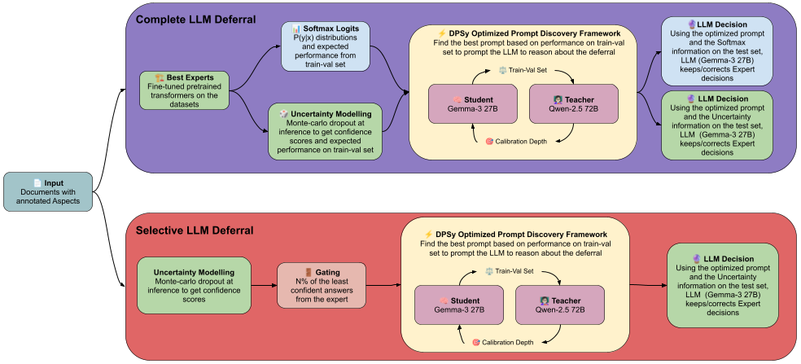
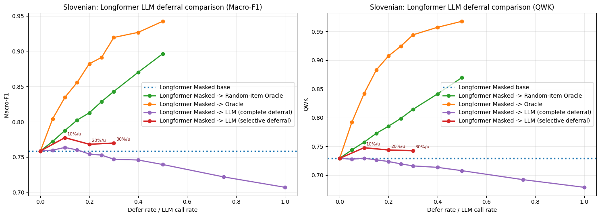
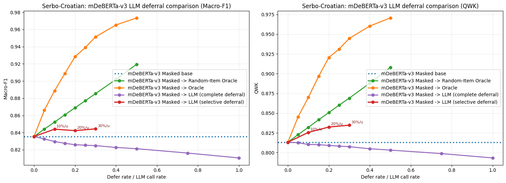
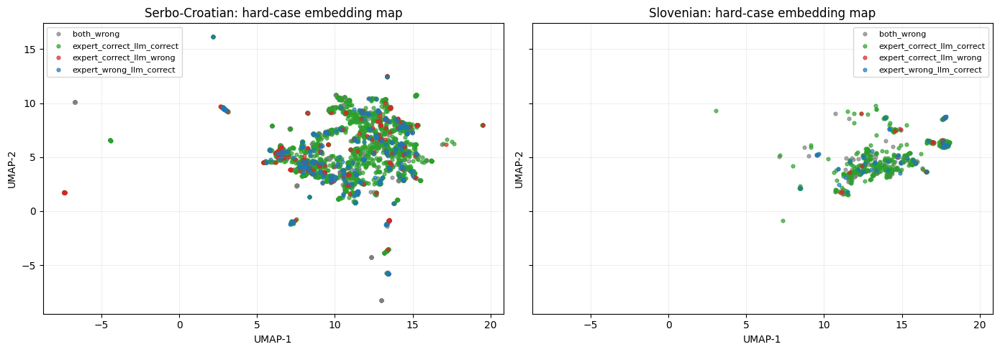
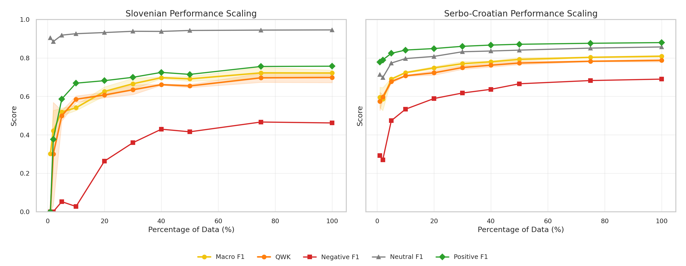
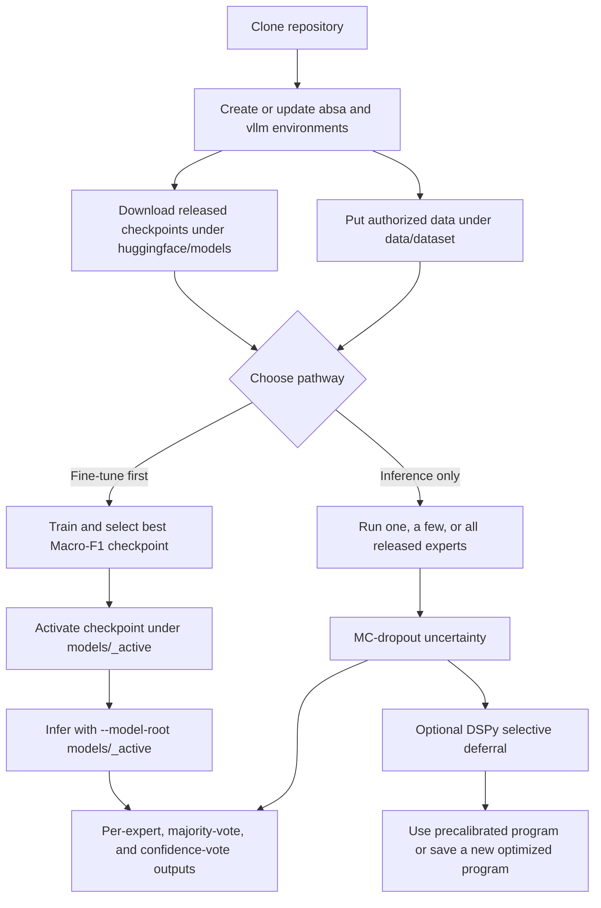

# AspectBench

AspectBench is the reusable release for document-level aspect-based sentiment
analysis in Slovenian and HBS (Bosnian/Croatian/Montenegrin/Serbian) news. It
contains fine-tuned model inference and training, Monte Carlo dropout
uncertainty, imbalance-aware evaluation, and DSPy selective deferral to local
LLMs.

- [Frontiers article](https://www.frontiersin.org/journals/artificial-intelligence/articles/10.3389/frai.2026.1844418/abstract)
- [HBS AspectBench 1.0 on CLARIN.SI](http://hdl.handle.net/11356/2356)
- [Hugging Face collection](https://huggingface.co/collections/nishan-chatterjee/aspect-based-sentiment-analysis-6a9016a6d9cab7b093f122d3)
- [Copy/paste interactive GPU runbook](docs/interactive-smoke-tests.md)

## What the system does

The practical configuration keeps a fine-tuned expert as the default and
routes only its least-confident cases to a local LLM. Fine-tuned PLM inference
first creates predictions, probabilities, and MC-dropout uncertainty. A frozen
DSPy program then decides whether to keep, override, or abstain on the gated
records; DSPy does not retrain or replace the PLM.



## Main paper findings

- The corpora contain 43,863 Slovenian train/validation and 7,740 test records,
  and 70,307 HBS train/validation and 12,407 test records. The class imbalance
  is substantial: Slovenian is approximately 1.2% negative, 82.6% neutral,
  and 16.2% positive; HBS is 7.5%, 49.5%, and 43.0%, respectively.
- The entity split is deliberately difficult: 69.2% of Slovenian and 59.1% of
  HBS test aspects are unseen in training. Reports therefore include overall,
  per-class, per-aspect, and seen/unseen Macro-F1 and quadratic weighted kappa.
- Aspect masking improved Macro-F1 in 13/18 and QWK in 14/18 reported model
  comparisons, but the best variant remains model- and language-dependent.
- Selective deferral was safer than complete LLM replacement. On Slovenian,
  routing 774/7,740 records (10%) raised masked Longformer Macro-F1 from 75.88
  to 77.34 and QWK from .729 to .745, with 45 corrections and 16 degradations.
  The HBS selective Longformer result reached 84.07 Macro-F1 and .830 QWK.
- Simple non-LLM aggregation remained competitive: Slovenian majority voting
  reached 76.35 Macro-F1; HBS confidence selection reached 84.18 Macro-F1 and
  .829 QWK.
- Learning curves show diminishing returns rather than one universal minimum:
  a broad performance band was reached around 40% of Slovenian and 30% of HBS
  training data, while the conservative one-standard-error rule selected 75%
  and 100%, respectively.

| Figure 2: Slovenian selective deferral | Figure 3: HBS selective deferral |
|---|---|
|  |  |





## Supported model registry

`--models` accepts one name, comma/space-separated names, or `all`. The three
names in examples are illustrative, not the complete list.

| Canonical name | Languages | Family |
|---|---|---|
| `xlmr` | HBS, Slovenian | XLM-R encoder |
| `han-xlmr` | HBS, Slovenian | hierarchical XLM-R |
| `longformer` | HBS, Slovenian | long-document XLM-R Longformer |
| `mdeberta-v3` | HBS, Slovenian | multilingual DeBERTa-v3 |
| `mt5` | HBS, Slovenian | text-to-text mT5 |
| `bertic` | HBS | BERTić |
| `sloberta` | Slovenian | SloBERTa |
| `bge-m3-mlp` | HBS, Slovenian | BGE-M3 dense embedding + MLP |

Every family has its own adapter under `src/aspectbench/models/`; numbered
files under `scripts/` only aggregate them. A requested missing checkpoint
fails clearly. With `--models all`, unavailable combinations are logged and
skipped so the remaining grid can finish. In particular, the selected
BGE-M3-MLP heads are not yet present in the Hugging Face release.

## Installation and environments

The `aspectbench` command exists only after this repository is installed. The
checked-in `absa.yml` and `vllm.yml` are exact conda exports with the
machine-specific `prefix` removed. Do this after cloning the repository:

```bash
source /opt/easybuild/software/Anaconda3/2024.02-1/etc/profile.d/conda.sh
bash scripts/0.0-bootstrap-environments.sh

conda activate absa
aspectbench models --models all
```

The bootstrap command creates missing `absa` and `vllm` environments from the
YAML files, installs this repository into both, and verifies the CLI. Existing
environments are left intact but the editable package is reinstalled. After a
pull that changes either YAML file, synchronize that environment—including
removing packages no longer declared in the export—with:

```bash
bash scripts/0.0-bootstrap-environments.sh --update
```

If the environments already contain the right dependencies, the immediate fix
for `aspectbench: command not found` is only the editable reinstall:

```bash
conda activate absa
python -m pip install -e . --no-deps
aspectbench models --models all
```

## Data, released models, and user checkpoints

Real records and large weights are intentionally ignored by Git but may exist
in both local release directories:

```text
data/hbs/{hbs_train_val_0,hbs_train_val_1,hbs_train_val_2,hbs_test,hbs_aspects}.json
data/sl/{slovene_train_val_0,slovene_train_val_1,slovene_train_val_2,slovene_test,slovene_aspects}.json
huggingface/models/MODEL/...             # released fine-tuned PLM checkpoints
models/MODEL/LANGUAGE/VARIANT/RUN-ID/... # newly trained checkpoints
models/gemma3-27b-qat/...gguf            # local serving asset
models/qwen2.5-72b/...gguf               # local serving asset
outputs/inference/LANGUAGE/RUN-ID/...    # detailed and ensemble predictions
```

HBS records are distributed under the CLARIN.SI access terms. Slovenian
records remain private and must only be copied from authorized storage. The
Git repository contains neither corpus; `.gitignore` also excludes record-level
predictions, uncertainty shards, user checkpoints, and GGUF files.

Populate the canonical paths before running a GPU job:

```bash
# HBS: use either a downloaded CLARIN archive or an authorized record URL.
bash scripts/0.1-download-hbs.sh --archive /path/to/clarin-aspectbench.zip
# bash scripts/0.1-download-hbs.sh --url "$AUTHORIZED_CLARIN_DOWNLOAD_URL"

# Slovenian: local authorized JSON files only; never commit these records.
bash scripts/0.2-import-sl-data.sh --source /path/to/authorized/slovene-release

# Released model repositories (requires access while the collection is private).
source /opt/easybuild/software/Anaconda3/2024.02-1/etc/profile.d/conda.sh
conda activate absa
hf auth login
python huggingface/scripts/download.py
```

The downloader writes all currently available released checkpoints under
`huggingface/models/`. Use repeated `--model MODEL` arguments to download only
selected repositories. `bertic` and `sloberta` are registry-level families
resolved from the language-specific contents of the `slavic-specific`
repository; users should select their canonical names at the CLI.

## Usage pathways



### Pathway A: inference with released fine-tuned models

Inference always returns the model prediction, posterior probabilities, and
MC-dropout uncertainty. With more than one expert it additionally returns:

- `majority_vote`: the most frequent label; a tie uses mean class probability,
  then the fixed neutral/negative/positive order if probabilities also tie.
- `confidence_vote`: the prediction from the expert with the largest posterior
  confidence. The selected model and variant are recorded explicitly.

For one tagged article, this direct command prints those decisions in the
terminal and also saves both output files:

```bash
source /opt/easybuild/software/Anaconda3/2024.02-1/etc/profile.d/conda.sh
conda activate absa
cd /Utilisateurs/nchatt01/GitHub/aspect-based-sentiment-analysis

ARTICLE='Tokom šestonedeljnog testiranja, redakcija je više puta kontaktirala <aspect>Primer Grupu</aspect> zbog nove usluge. Prvi odgovor <aspect>Primer Grupe</aspect> stigao je istog dana, a tehnički tim je zatim otklonio prijavljenu grešku bez dodatnih troškova. U završnom upitniku većina korisnika ocenila je podršku kao jasnu i pouzdanu.'

CUDA_VISIBLE_DEVICES=0 aspectbench infer \
  --models xlmr han-xlmr longformer --dataset hbs --variant masked \
  --run-id single-article --input-doc "$ARTICLE" --mc-passes 8 \
  --filename timestamp
```

The terminal JSON is shaped as follows (values below are illustrative):

```json
{
  "experts": [
    {"model": "xlmr", "variant": "masked", "prediction": 1,
     "prediction_name": "positive", "confidence": 0.91}
  ],
  "majority_vote": {"prediction": 1, "prediction_name": "positive",
    "vote_counts": {"-1": 0, "0": 1, "1": 2}, "tied": false},
  "confidence_vote": {"prediction": 1, "prediction_name": "positive",
    "selected_model": "xlmr", "selected_variant": "masked", "confidence": 0.91}
}
```

Labels are `-1 = negative`, `0 = neutral`, and `1 = positive`. Confidence is
the largest mean class probability, not calibrated accuracy. MC uncertainty
details—including entropy, top-two margin, agreement, and variation ratio—are
retained in the detailed output.

For a JSON/JSONL collection, the multi-GPU launcher assigns each model/variant
task to one GPU, preserves its resumable shards, and aggregates after every
task succeeds:

```bash
CUDA_VISIBLE_DEVICES=0,1 bash scripts/run-aspectbench.sh --inference \
  --gpus 0,1 --models 'xlmr,longformer,mdeberta-v3' --dataset hbs \
  --variant best --run-id hbs-inference --input data/hbs/hbs_test.json \
  --mc-passes 8 --filename timestamp
```

With a run started at 14:07 on 2 September 2026, the user-facing files are:

```text
outputs/inference/hbs/hbs-inference/2026-09-02-1407-predictions.json
outputs/inference/hbs/hbs-inference/2026-09-02-1407-predictions-ensemble.json
```

The first contains one row per expert and record; the second contains one row
per record with `experts`, `majority_vote`, and `confidence_vote`. It also
provides the scalar `majority_prediction` and `confidence_prediction` fields
so either decision can be passed directly to the scoring CLI. Use
`--filename predictions` for a stable name, `--filename seed --seed 17` for
`seed-17-predictions.json`, or `--filename experiment-a` for a custom stem.
All generated outputs are Git-ignored because their article fields may contain
restricted text.

`--models all` selects the full language-compatible registry, not only the
three illustrative models above. `--variant best` uses the paper-selected
variant for each model; `--variant both` treats each model/variant pair as an
expert. The launcher respects `PYTHON_BIN` when a specific interpreter is
needed.

### Pathway B: fine-tune, then infer

Full training validates every epoch, saves the best Macro-F1 checkpoint and
resumable optimizer state, activates the best checkpoint, then automatically
creates MC-dropout uncertainty files for validation and every named split:

```bash
source /opt/easybuild/software/Anaconda3/2024.02-1/etc/profile.d/conda.sh
conda activate absa

CUDA_VISIBLE_DEVICES=0,1,2,3 bash scripts/run-aspectbench.sh --train \
  --gpus 0,1,2,3 --models all --dataset hbs --variant best \
  --run-id hbs-train --train-input data/hbs/hbs_train_val_0.json \
  --val-input data/hbs/hbs_train_val_0.json \
  --uncertainty-input test=data/hbs/hbs_test.json --epochs 3 --mc-passes 10
```

Use `--train --smoke --input ...` for exactly one real optimizer update plus a
strict save/reload check. Runs are resumable by default; atomic shards,
manifests, progress JSON, and `_logs/` live under `models/_runs/`. See the
[interactive runbook](docs/interactive-smoke-tests.md) for `--input-doc`,
monitoring, and cleanup examples.

After full training, `models/_active/` exposes the latest best checkpoints in
the same layout as `huggingface/models`. Pass `--model-root models/_active` to
inference or DSPy to reuse them; omit it to use the packaged fine-tuned models:

```bash
CUDA_VISIBLE_DEVICES=0,1 bash scripts/run-aspectbench.sh --inference \
  --gpus 0,1 --models 'xlmr,longformer' --dataset hbs --variant best \
  --run-id trained-model-inference --model-root models/_active \
  --input data/hbs/hbs_test.json --filename seed --seed 42
```

## Precalibrated and newly optimized DSPy programs

Audited paper-time programs are tracked at:

```text
selective-deferral-programs/precalibrated/MODEL/DATASET/PROMPT-VARIANT/
```

Use them over the released fine-tuned models with
`--program-source precalibrated`. A user’s programs optimized on the same or a
new authorized dataset are kept separately at:

```text
selective-deferral-programs/optimized/MODEL/DATASET/PROMPT-VARIANT/RUN-ID/
```

That second tree is ignored by Git and selected with
`--program-source optimized --program-run-id RUN-ID`. Program metadata is
checked against the primary model, dataset, and prompt variant before querying.
The three historical Slovenian programs that embedded article examples are not
published; their public replacements are sanitized, example-free programs
with new checksums and no claim of behavioral identity.

Example using a packaged program and four local Gemma endpoints:

```bash
PYTHON_BIN=/Utilisateurs/nchatt01/.conda/envs/vllm/bin/python \
DATASET=hbs INPUT=data/hbs/hbs_test.json TASK_FILTER=all \
VARIANT_MODE=best PROMPT_VARIANTS='masked unmasked' GATE_RATE=0.10 \
STUDENT_API_BASES='http://127.0.0.1:18000/v1,http://127.0.0.1:18001/v1,http://127.0.0.1:18002/v1,http://127.0.0.1:18003/v1' \
NUM_WORKERS_PER_ENDPOINTS='12,12,12,12' MAX_PARALLEL=1 \
bash scripts/2.4-query-dspy-programs.sh
```

## Local LLM serving rule of thumb

On a 48 GB A40/A6000, start one quantized Gemma server per GPU with 16 slots
and a 196,608-token total context: 16 × 12,288 tokens per slot. If it does not
fit, reduce context and parallelism by the same factor, for example
98,304/8 or 49,152/4. On a 96 GB H100, 589,824/48 uses the same per-slot
budget. `-c` is the server-wide context pool, not the per-request limit.

```bash
# Four 48 GB GPUs, ports 18000-18003.
GPU_IDS=0,1,2,3 PORTS=18000,18001,18002,18003 \
CONTEXT_SIZE=196608 PARALLEL=16 \
bash scripts/2.3-launch-gemma-llama-cpp.sh

# One 96 GB H100.
CUDA_VISIBLE_DEVICES=0 bash scripts/2.0-serve-llm.sh --backend llama-cpp \
  --llama-server ./llama.cpp/build/bin/llama-server \
  --model models/gemma3-27b-qat/gemma-3-27b-it-q4_0.gguf \
  --model-alias gemma27b --host 0.0.0.0 --port 8000 \
  --context-size 589824 --parallel 48 --run-id gemma-h100
```

The runbook also includes two-GPU vLLM Gemma/Qwen serving and DSPy MIPROv2
student/teacher optimization. Model fit still depends on quantization, KV-cache
type, build, and concurrent prompt lengths, so begin conservatively and inspect
the saved server log.

## Evaluation and extending the release

```bash
aspectbench score --predictions predictions.json \
  --train-data data/hbs/hbs_train_val_0.json --output report.json

# Score an ensemble export instead of per-expert rows.
aspectbench score \
  --predictions outputs/inference/hbs/hbs-inference/predictions-ensemble.json \
  --prediction-key majority_prediction \
  --train-data data/hbs/hbs_train_val_0.json --output majority-report.json
```

The report includes overall Macro-F1/QWK, per-class metrics, per-aspect
Macro-F1/QWK, imbalance diagnostics, and seen/unseen results. A runnable
example is in `notebooks/evaluation-and-aspect-reporting.ipynb`. See
`docs/extending-models-and-data.md` for the kebab-case model registration and
new-dataset contracts.

## Repository layout and `backup/`

The clean API lives in `src/`, numbered launchers in `scripts/`, configuration
in `configs/`, reusable analyses in `notebooks/`, public programs in
`selective-deferral-programs/`, and release provenance in `provenance/`.
`backup/` is a curated, non-API provenance snapshot. Use it to trace an old
experiment, not as a second supported interface:

| Path | Contents |
|---|---|
| `backup/camera-ready/scripts/` | final experiment-era data, expert, uncertainty, deferral, analysis, and minimum-viable-set entry points |
| `backup/camera-ready/hpc-tasks/` | original interactive, SLURM-array, Apptainer, merge, and progress helpers |
| `backup/camera-ready/configs/chat-templates/` | preserved Gemma and Qwen serving templates |
| `backup/historical/scripts/` | first-submission and exploratory entry points |
| `backup/legacy/scripts/` | earliest useful Git-history scripts |

It excludes corpora, record-level outputs, weights, unsafe prompt originals,
review correspondence, logs, caches, and output-bearing notebooks. Historical
scripts may require path/configuration translation and are not covered by the
clean API tests. Old review-cycle filenames were changed to neutral
`additional comparison` wording. See `backup/README.md` for the complete scope
and exclusions.

## Citation

```bibtex
@article{chatterjee2026aspectbench,
  title   = {Evaluating Fine-Tuned, Embedding-Based, and Zero-Shot Models for
             Aspect-Based Sentiment Analysis in South Slavic News},
  author  = {Chatterjee, Nishan and Koloski, Boshko and Doucet, Antoine and
             Pollak, Senja and Purver, Matthew},
  journal = {Frontiers in Artificial Intelligence},
  volume  = {9},
  year    = {2026},
  doi     = {10.3389/frai.2026.1844418},
  url     = {https://www.frontiersin.org/journals/artificial-intelligence/articles/10.3389/frai.2026.1844418/abstract}
}
```

See `CITATION.cff` for citation tooling and the CLARIN.SI record for the final
dataset citation and access conditions.
